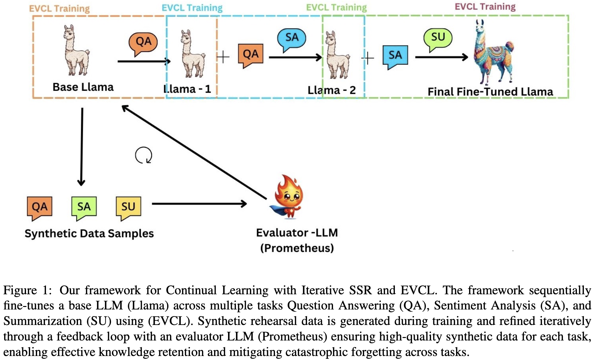

# Iterative Self-Synthesized Rehearsal and Elastic-Variational Continual Learning for Catastrophic Forgetting

This repository contains the implementation of our proposed framework to mitigate catastrophic forgetting in large language models (LLMs). Our framework integrates **Elastic-Variational Continual Learning (EVCL)** with **Iterative Self-Synthesized Rehearsal (SSR)**, which ensures high-quality synthetic datasets for continual learning in NLP tasks.

## Overview

In continual learning, models suffer from **catastrophic forgetting**, where previously learned knowledge is overwritten while learning new tasks. Our research introduces an iterative feedback mechanism to improve **SSR** using an **Evaluator LLM** and integrates it with **EVCL** to enhance task retention and reduce forgetting in LLMs.

## Key Contributions

- **Enhanced SSR**: We propose a feedback-driven iterative refinement process for synthetic data generation using an Evaluator LLM (Prometheus).
- **EVCL for NLP**: We extend EVCL, originally applied to computer vision, to **LLMs** for NLP tasks, using **Low-Rank Adaptation (LoRA)** weights for efficient fine-tuning.
- **Continual Learning Framework**: Our approach combines EVCL and SSR for robust continual learning, offering improved task retention and efficiency.

## Datasets and Tasks

### Datasets:
- **SuperNI (Wang et al., 2022)**: A comprehensive benchmark dataset for instruction tuning in NLP tasks.

### Tasks:
- **Question Answering (QA)**
- **Sentiment Analysis (SA)**
- **Summarization (SU)**

## Installation

1. Clone the repository:
   ```bash
   git clone https://github.com/pranavsharma9/Iterative-SSR-and-EVCL-Catastrophic-Forgetting.git
   cd Iterative-SSR-and-EVCL-Catastrophic-Forgetting



